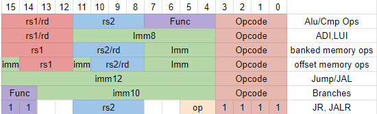

# BRISC-16
BRISC-16 is a 16-bit 5-stage pipelined CPU im currently building Using 74hct chips and PCB's. It uses a custom 16-bit Load/Store Architecture **[Instruction Set](#instruction-set)**  

## Pipeline
  Very similar to a risc v 5 stage pipeline. This isnt the exact schematic but it has the same pipeline 

## Registers
  16 total registers 11 used in actual build.  
  
  Each register has an input bus connected to the write back stage and two output buses connected into 74hct574 at the decode stage for input into the alu. 
  
  -  `Data Registers` r0-r7 
  -  `Address Registers` r8-r14 - can be decremented or incremented by push and pop. 
  -  `Program Counter` r15 - sepereated from the other registers to allow for write back during the alu stage and for simultaneous fetch and memory operation. 
      -  during fetch to instruction memory, the program counter is directly connected to instruction memory until a banked load/store happens where the bank offset = 1, then the fetch is stalled 1 cycle and nop inserted 

## Alu
  -  16-bit version of James Sharman's Alu but register register moves happen through it and flags have a seperate latch so they arent updated on every instruction.
  -  LHS and RHS both have a 4 input multiplexer to switch between the immediate value, PC, register input, and MEM or WB forward values. 

## Memory
  2MB of total word addressed memory.
  -  0 - 0xffff - Data Memory
  -  0x10000 - 0x1ffff - Instruction Memory
  -  0x2000 - 0xfffff - extent of banked memory range can be used for anything

## Write Back/Forward line
  how the cpu keeps track of what data needs to get written back and if a data forward needs to happen into the alu
  -  4 bit rd value during memory and write back stage is xnored with the current LHS and RHS register input to see if the alu is getting data from a register that hasnt been written back to yet. 
  
## Instruction Set
16 main instructions plus 15 alu functions 
- `Alu Operations`
  -  `NOP` 
  -  `ADD` 
  -  `SUB` 
  -  `MOVE` 
  -  `SHR`
  -  `SHL`
  -  `AND`
  -  `OR`
  -  `XOR`
  -  `NOT`
  -  `ADC`
  -  `SUBB`
-  `ADI`: rd += sign extended 8-bit immediate 
-  `LOAD/STORE` with offset:
   -  rd limited to first 8 registers
   -  rs2 limited to last 8 registers
   -  memory address = rs2 + sign extended 6-bit immediate
- `LOAD/STORE`, `PUSH/POP` with banked offset
  -  16 bit addesss is extended by 4 bits provided by the immediate
-  `JUMP` - pc += 12 bit sign extended offset
- `JZ` - Jump if zero flag
- `JNZ` - Jump if not zero flag
- `JC` - Jump if carry flag
- `JNC` - Jump if not carry flag
- `JO` - Jump if overflow flag
- `LUI` - Load Upper Immediate 
- `JAL` - Jump and link with hardcoded return address register. Currently Ra is r10 but i might move it if i want to use a data register instead of an address register.
  
   
